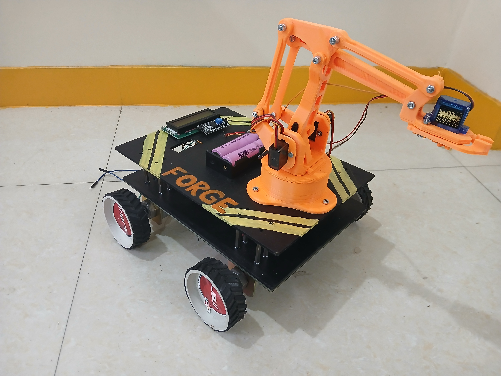

# Forge-X
<p align="center">
  
</p>

### Multi-Functional 4WD RC Rover with Single Robotic Arm# Forge-X 
## Multi-Functional 4WD RC Rover with Single Robotic Arm

Forge-X is a 4-wheel-drive remote-controlled robotic rover combining
mobile locomotion, wireless communication, and a single servo-controlled
robotic arm.

The documented prototype uses:
- ESP32 WROOM as the main controller
- Flysky FS-i6X transmitter
- FS-iA10B receiver
- 2.4 GHz AFHDS 2A wireless link
- 2 × L298N dual H-bridge motor drivers
- 4 × 300 RPM DC geared motors
- MG90 servo for the arm
- 16×2 I2C LCD
- 5200 mAh LiPo battery
- MDF chassis

> Note: The Arduino code and pin mapping included in this repository are
> a reference implementation. The project report does not provide the
> original source code or exact GPIO mapping, so verify the wiring before
> using the code on hardware.

## Features
- 4WD skid-steer locomotion
- Forward and backward movement
- Left/right in-place turning
- Wireless 2.4 GHz RF control
- ESP32-based control
- Single robotic arm
- Servo positioning
- 16×2 I2C LCD feedback
- Modular platform for future sensors and autonomy

## Architecture

```text
Flysky FS-i6X
      │
  2.4 GHz RF
      ▼
 FS-iA10B Receiver
      │
 PWM / IBUS
      ▼
  ESP32 WROOM
    │      │
    ▼      ▼
 L298N   Servo
 Drivers   │
    │      ▼
    ▼    Arm Joint
 4 DC Motors

      +
      ▼
 16×2 I2C LCD
```

## Locomotion

| Motion | Left Wheels | Right Wheels |
|---|---|---|
| Forward | Forward | Forward |
| Backward | Reverse | Reverse |
| Turn Left | Reverse | Forward |
| Turn Right | Forward | Reverse |

The skid-steer arrangement enables zero-radius turning.

## Software
- Arduino IDE
- C++
- ESP32 board support
- `Wire.h`
- `LiquidCrystal_I2C.h`
- `ESP32Servo.h`

## Testing
The project report documents:
- Maximum PWM setting: 255
- Battery life: 30–45 minutes
- Turning radius: Zero / in-place
- Arm reach: TBD

## Known Challenges
- Voltage drop during combined motor and servo operation
- ESP32 resets under heavy load
- L298N heating and voltage loss
- Wheel scrubbing during skid-steer turns
- Transmitter neutral drift
- Chassis flex/misalignment
- Servo jitter during simultaneous drive

## Future Scope
- Ultrasonic/LiDAR obstacle avoidance
- FPV camera
- Closed-loop arm control
- Battery voltage/current monitoring
- Multi-DOF arm
- Gripper force sensing
- Object detection
- Autonomous navigation

## Team
- Prathmesh Kulkarni
- Prathamesh Nibandhe
- Vaishnavi Surwase
- Bhoomi Oswal
- Sharwani Sawant
- Sanskar Malore

## Institution
P.E.S. Modern College of Engineering

## Repository Structure

```text
Forge-X/
├── README.md
├── LICENSE
├── .gitignore
├── src/
│   └── ForgeX.ino
├── docs/
│   ├── SYSTEM_ARCHITECTURE.md
│   ├── HARDWARE.md
│   ├── WORKING_PRINCIPLE.md
│   ├── TESTING.md
│   └── FUTURE_SCOPE.md
├── hardware/
│   ├── pinout.md
│   └── wiring.md
├── images/
│   └── README.md
└── report/
    └── Forge-X_Project_Report.pdf
```
